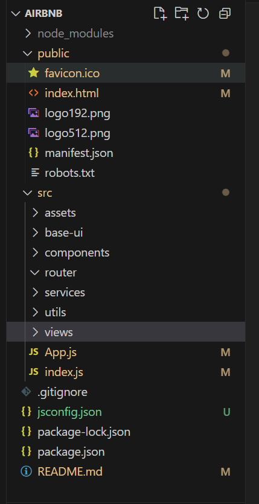

# airBnb
关于用React仿写爱彼迎网站

* 项目配置：
  配置项目的icon,
  配置项目的标题
  配置jsconfig.json

* 通过craco配置别名和less文件
   @=> src :webpack
   问题：reace脚手架隐藏webpack
   解决一：npm run eject
   解决二：craco =>  npm install @craco/craco@alpha -D
           在根目录下创建craco.config.js文件
    在craco.config.js中配置别名和less文件
    ```
      const path = require('path')
      const resolve = pathname => path.resolve(__dirname, pathname)
      module.exports = {
          webpack: {
            alias:{
              "@":resolve("src"),
              "components":resolve("src/components"),
              "utils":resolve("src/utils"),
            }
          }
      }
    ```
    然后在package.json中配置
    ```
      "scripts": {
        "start": "craco start",
        "build": "craco build",
        "test": "craco test",
        "eject": "craco eject"
      },
    ```
    然后就可以使用了
    ```
      npm start
      npm run build
    ```

* 配置less
  1. 安装npm i craco-less@2.1.0-alpha.0
  2. 在craco.config.js中配置less
   ```
   const path = require('path')
     const CracoLessPlugin = require('craco-less')
     const resolve = pathname => path.resolve(__dirname,pathname)
     module.exports = {
       webpack:{
         alias:{
           // 别名
           // "@":path.resolve(__dirname,"src"),
           "@":resolve("src"),
           "components":resolve("src/components"),
           "utils":resolve("src/utils")
         }
       },
       plugins:[
         {
           //less
           plugin: CracoLessPlugin
         },
       ],
     }
   ```
  3. 在src目录下创建index.less文件

* 项目目录结构
  

* css样式的重置
   1. npm install normalize.css
   2. 在index.js中引入：import "normalize.css"
   3. 创建reset.less文件和variable.less文件
   
* Router配置
  npm install react-router-dom
  1. 在index.js中引入 import { BrowserRouter } from 'react-router-dom'


* Reduxh状态管理
  1. 普通方式： 目前项目中依然使用率非常高
  2. @reduxjs/toolkit方式：推荐方式，未来的趋势
   安装 npm install @reduxjs/toolkit react-redux
   1. 在src目录下创建store文件夹
   2. 在store文件夹下创建index.js文件
   3. 在根目录index.js文件导入Provider //import { Provider } from "react-redux"
1. 

*  网络请求,对axios进行二次封装
  npm install axios

  * Header的封装和整体布局
  css的样式：
  npm install styled-components


*  icons的使用
*  npm install @mui/material @mui/styled-engine-sc
*  npm install @mui/material @emotion/react @emotion/styled

也可以安装antd design
npm install antd

首页滚动区域